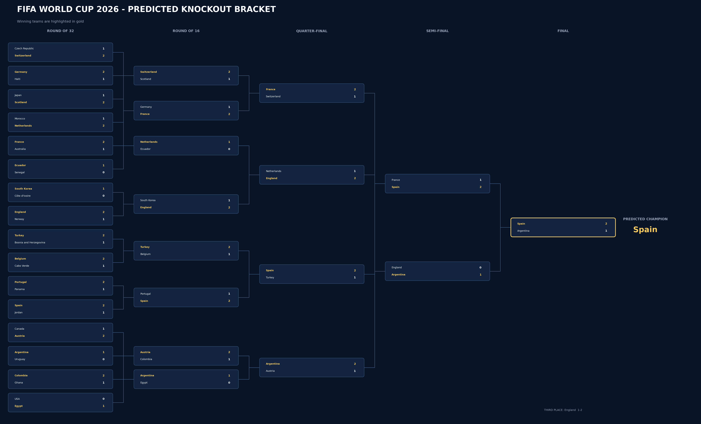
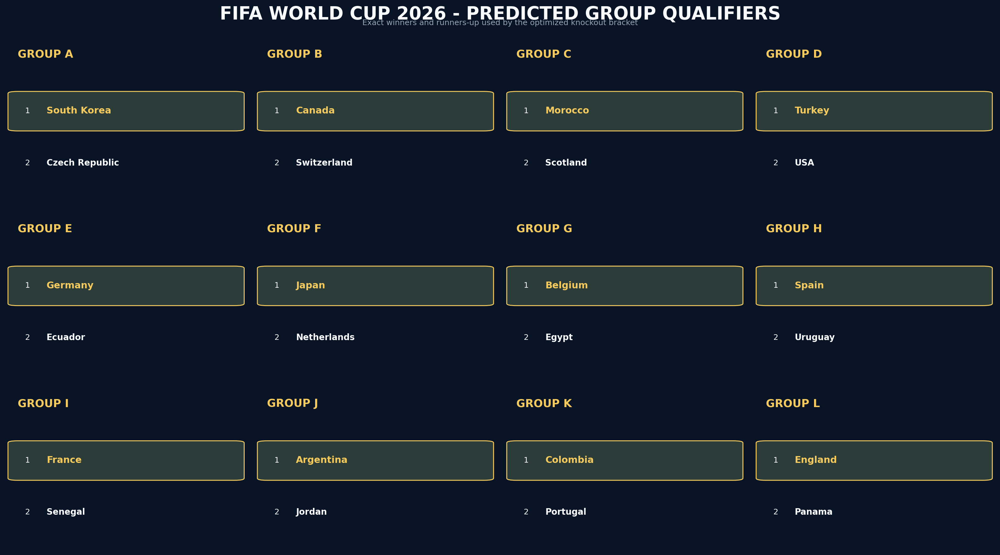
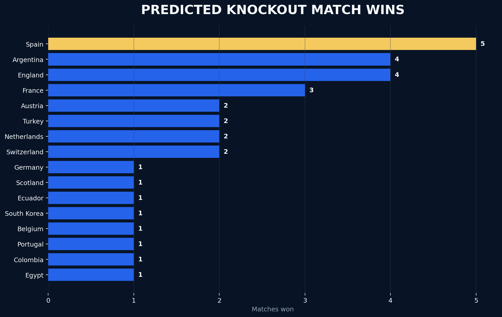
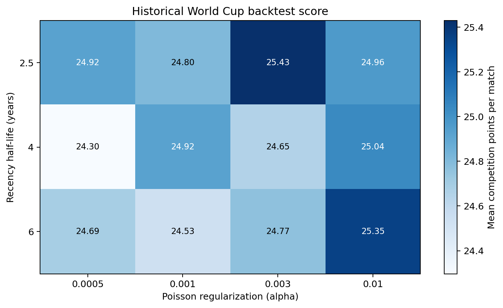
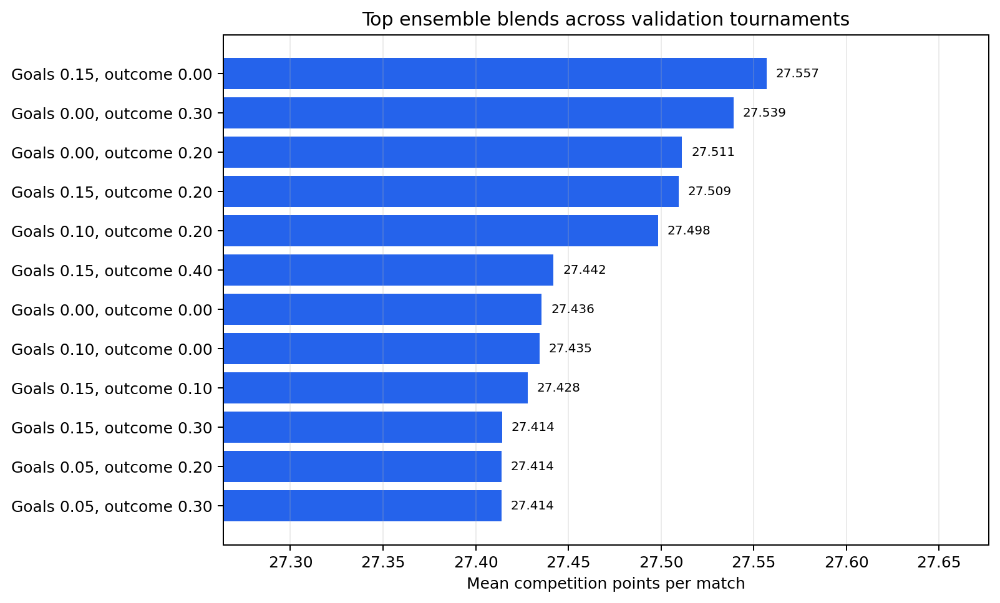
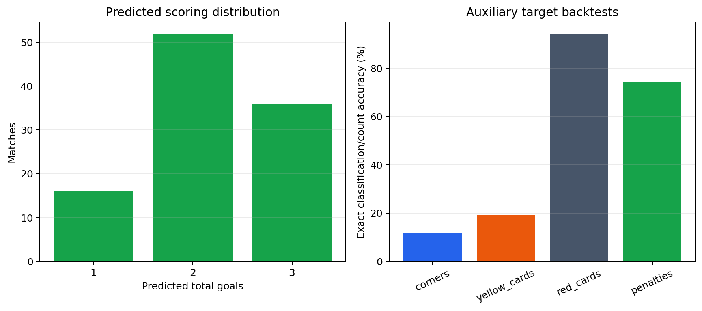

# FIFA World Cup 2026 Prediction Pipeline

This repository generates predictions for all 72 group matches and 32 knockout
matches in the 2026 FIFA World Cup. Outputs include scores, results, corners,
yellow cards, red cards, knockout teams, winners, and penalties.

The active pipeline is script-based. `comp-notebook/notebook.ipynb` is generated
from the final CSV outputs and is the submission artifact, not the source of the
modeling logic.

## Current Results

The committed results use data available through **June 10, 2026** and the
fixed random seed `20260610`.

| Result | Value |
|---|---:|
| Group predictions | 72 matches |
| Knockout predictions | 32 matches |
| Selected Poisson alpha | 0.003 |
| Selected recency half-life | 2.5 years |
| Poisson model backtest | 25.43 points/match |
| Selected gradient goal weight | 0.15 |
| Selected outcome classifier weight | 0.00 |
| Ensemble backtest | 27.56 points/match |
| Predicted finalist | Spain vs Argentina |
| Predicted champion | Spain |

These are model outputs, not known tournament outcomes. Backtest scores are
historical validation results under the competition scoring rules.

## Visualizations

### Predicted Tournament Bracket

Gold text marks the predicted winner of every knockout fixture.



### Predicted Group Qualifiers

These winners and runners-up are the exact teams used by the optimized
knockout-bracket scenario.



### Knockout Wins



### Model Diagnostics







Regenerate all figures from the committed result CSVs:

```bash
python visualize_results.py
```

## Repository Structure

```text
.
├── build_submission.py          # Training, simulation, optimization, output
├── ensemble_models.py           # Rolling features and ensemble models
├── external_features.py         # Odds, squads, injuries, external adjustments
├── refresh_external_data.py     # Elo, squads, odds, and team corner estimates
├── refresh_club_data.py         # Historical club corner/card downloader
├── visualize_results.py         # Deterministic result visualizations
├── data/                        # Historical and current input data
├── comp-notebook/
│   ├── data/                    # Fixture and bracket definitions
│   ├── *.csv                    # Predictions and backtest outputs
│   └── notebook.ipynb           # Generated submission notebook
└── figures/                     # Generated README visualizations
```

## Reproducing the Results

Python 3.11 or newer is recommended.

```bash
python -m venv .venv
source .venv/bin/activate
pip install -r requirements.txt
python build_submission.py
python visualize_results.py
```

`build_submission.py` retrains the models, runs 50,000 tournament simulations,
and rewrites:

- `comp-notebook/group_predictions.csv`
- `comp-notebook/knockout_predictions.csv`
- `comp-notebook/model_backtest.csv`
- `comp-notebook/ensemble_backtest.csv`
- `comp-notebook/auxiliary_backtest.csv`
- `comp-notebook/notebook.ipynb`
- `data/worldcup/squads_2026.csv`
- `data/squad_strength_2026.csv`

The pipeline can run from the committed snapshots without downloads. To refresh
volatile external inputs first:

```bash
python refresh_external_data.py
python build_submission.py
python visualize_results.py
```

`refresh_external_data.py` requires the `pdftotext` executable. Refreshing data
can change predictions, so record the retrieval date and inspect the diff.

The club corners/cards training file is refreshed separately:

```bash
python refresh_club_data.py
```

## Data Sources

| Input | Purpose |
|---|---|
| `data/results.csv` | International results for goals, outcomes, Elo, and form |
| `data/world_elo_2026-06-10.tsv` | Current World Football Elo snapshot |
| `data/worldcup/data-csv/` | Historical World Cup matches, stages, bookings, and shootouts |
| `data/club_corners_cards_2016_2025.csv` | Club training data for total corners |
| `data/worldcup/squads_2026.txt` | Parsed official FIFA squad-list source |
| `data/market_odds_2026.csv` | Optional group-stage 1X2 and goal-total priors |
| `data/international_match_stats_2026.csv` | Optional current corner/card overrides |
| `data/injuries_2026.csv` | Optional squad availability penalties |
| `data/referee_assignments_2026.csv` | Optional referee card-rate adjustments |
| `comp-notebook/data/` | Fixtures, bracket slots, and third-place mappings |

Empty optional files are valid and have no effect. Populated optional files are
validated before being blended into predictions.

## Method

### 1. Historical sample

International matches are limited to January 1, 2006 through June 10, 2026.
Rows without final scores are removed. Team aliases are normalized so external
sources and historical results use the same identifiers.

Training observations receive two weights:

- **Recency:** exponential decay with a tuned half-life.
- **Importance:** World Cups receive the largest weight (`3.0`), followed by
  continental championships and qualifiers; friendlies receive `0.55`.

### 2. Baseline goal model

Each historical match becomes two team-level rows: one for home goals and one
for away goals. A regularized Poisson regression estimates scoring rates from
the attacking team, opponent, and venue indicator.

The regularization parameter and recency half-life are selected by backtesting
the 2018 and 2022 World Cups. The search covers four alpha values and three
half-lives. `model_backtest.csv` reports mean competition points per match, not
log loss or RMSE.

Expected goals are then split using a blend of the fitted Poisson
attack/defense ratio, a historical Elo ratio, and the June 10, 2026 World
Football Elo snapshot.

### 3. Rolling team features

Features are calculated strictly before each historical match:

- Elo and Elo difference;
- exponentially updated attack and defense rates;
- recent points-based form;
- international match experience;
- neutral-venue indicator;
- tournament importance.

The rolling update rate is `0.16`. Host teams (USA, Canada, and Mexico) receive
a 45-point Elo bonus for 2026 predictions.

### 4. Ensemble

Two histogram gradient-boosting regressors predict home and away goals. A
histogram gradient-boosting classifier predicts home/draw/away probabilities.
All models use recency and tournament-importance sample weights.

Blend weights are selected over nine held-out tournament windows from 2016 to
2025. The committed run selected:

- `15%` gradient-boosted goal rates and `85%` Poisson goal rates;
- `0%` direct outcome-classifier probability and `100%` score-derived outcome
  probability.

Where available, market goal totals adjust the expected total by `30%`.
Market-implied team strength adjusts the home/away split by `40%`, and 1X2
probabilities receive a final `35%` weight.

### 5. Squads and injuries

Official FIFA squad lists are parsed from the supplied PDF text. Squad strength
uses average age, share of players at big-five leagues, club-tier mix, forward
count, and goalkeeper height. The resulting adjustment is capped to
`[-55, +55]` Elo points.

Confirmed `out` or `doubtful` players can reduce squad strength through the
numeric `impact` field in `data/injuries_2026.csv`.

### 6. Score and outcome decisions

Expected goals define an independent Poisson score matrix from 0 to 9 goals per
team. The submitted score is not simply the most likely scoreline. It maximizes
expected competition points:

- 25 points for the exact score;
- 10 points for the correct goal difference;
- 10 points for the correct total goals;
- 40 points for the correct result.

Knockout score matrices add a 30-minute extra-time Poisson process. A required
winner constraint keeps each knockout score consistent with the selected team.

### 7. Tournament simulation

The pipeline runs 50,000 seeded simulations of all group and knockout matches.
Group ranking uses:

1. points;
2. head-to-head points;
3. head-to-head goal difference;
4. head-to-head goals scored;
5. overall goal difference;
6. overall goals scored;
7. Elo as a deterministic final tie-breaker.

The eight best third-place teams are mapped with the committed FIFA Annex C
table. Rather than selecting only the most common complete bracket, the code
evaluates the 500 most frequent scenarios and chooses the bracket with the
highest expected competition score across matchup and winner predictions.

### 8. Corners, cards, and penalties

- **Corners:** Poisson gradient boosting trained on 2016-2025 European club
  match totals. Current international estimates, when present, receive 35%.
- **Yellow cards:** Poisson gradient boosting trained on historical men's World
  Cup bookings matched to pre-match team features.
- **Red cards:** calibrated, class-balanced logistic regression predicting
  whether a match has any sending-off.
- **Penalties:** calibrated, class-balanced logistic regression on historical
  knockout matches.

Count submissions maximize the relevant competition points instead of rounding
the raw model mean. Referee card rates, when present, receive 30% weight.

## Validation

Validation is time ordered:

- Poisson hyperparameters are tested on the 2018 and 2022 World Cups.
- Ensemble blends are tested on tournament windows from 2016 through 2025.
- Corner validation holds out matches from July 2023 onward.
- Card and penalty validation holds out World Cup matches from 2018 onward.

Current auxiliary results:

| Target | Test matches | Mean points | Exact accuracy |
|---|---:|---:|---:|
| Corners | 11,083 | 3.26 | 11.5% |
| Yellow cards | 125 | 3.20 | 19.2% |
| Red cards | 125 | 4.72 | 94.4% |
| Penalties | 31 | 3.71 | 74.2% |

Red-card and penalty classes are rare. Their high raw accuracy largely reflects
the dominant negative class and should not be interpreted as strong event
detection.

## Assumptions and Limitations

- Match goals are conditionally independent Poisson counts after feature
  adjustment; score dependence is not modeled with a Dixon-Coles correction.
- All 2026 matches are treated as neutral, with host advantage added through
  Elo rather than a venue feature.
- Qualified playoff placeholders are replaced by the teams listed in
  `QUALIFIED_TEAMS` in `build_submission.py`.
- Elo, squad, odds, injuries, and referee inputs may become stale after June
  10, 2026.
- Club corner patterns are used as a proxy because international corner data is
  much smaller. This is a domain-transfer assumption.
- Market odds are optional and cover only fixtures available from the source.
- Group tie-breaking approximates FIFA rules and uses Elo instead of drawing
  lots or disciplinary points as the final deterministic tie-breaker.
- A single optimized bracket must be submitted even though actual knockout
  participants depend on uncertain group results.
- Backtest tuning optimizes the competition score directly; results should not
  be compared directly with conventional predictive metrics.

## Output Contract

`group_predictions.csv` contains one row per group fixture with:

```text
match_id, group, home_team, away_team, date_utc, venue,
predicted_home_goals, predicted_away_goals, corners,
yellow_cards, red_cards, winning_team
```

`knockout_predictions.csv` contains one row per bracket match with resolved
teams, predicted scores, auxiliary counts, winner side, and penalty flag.

The generated notebook validates row counts, missing values, allowed labels,
and consistency between knockout scores and selected winners.
